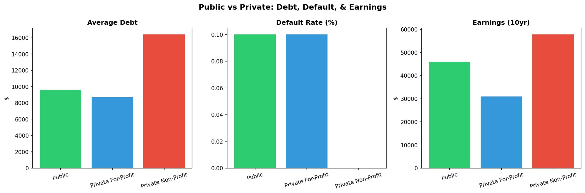
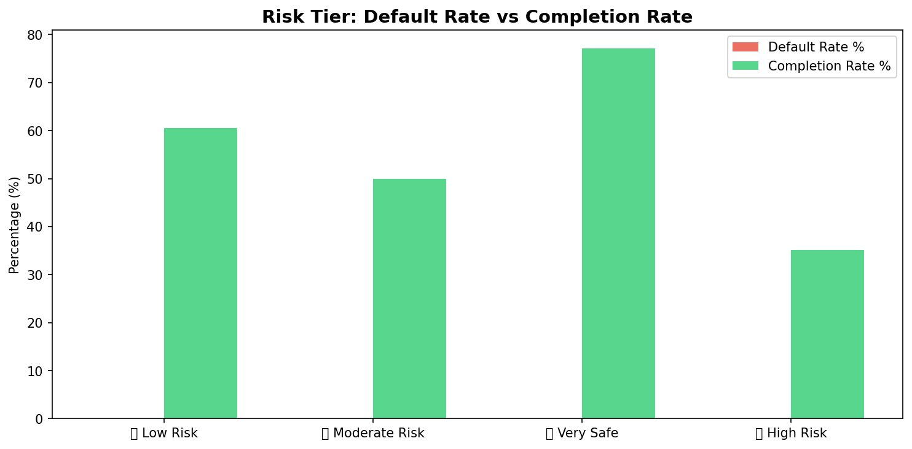
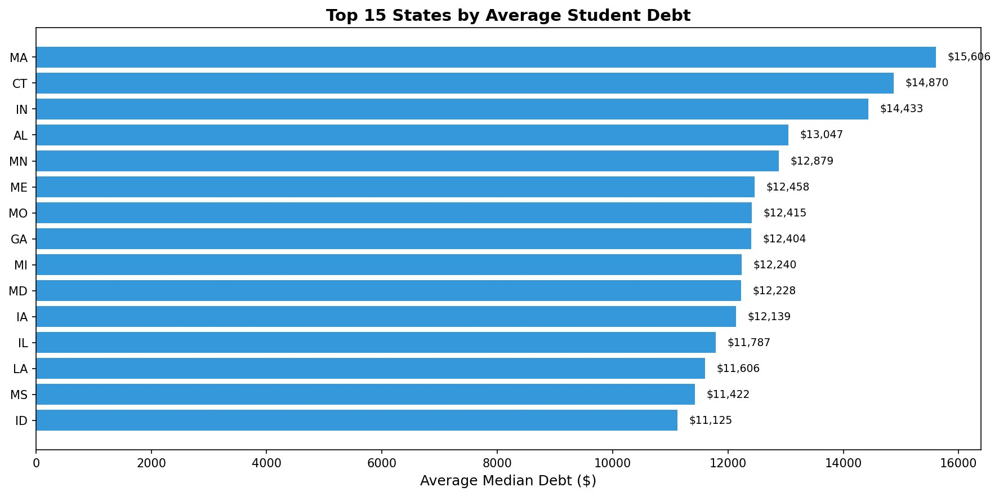

# 🎓 U.S. Student Loan Risk Analysis — Which Schools Leave Students in Debt?

> **SQL-driven analysis** of student loan burden, default risk, and institutional ROI across 1,760 U.S. colleges and universities using College Scorecard data.

📌 **This is Part 2** of my Higher Education Analysis series:
- **Part 1** (Python EDA): [College Tuition Spending Analysis](https://github.com/Katherine-code-web/college-tuition-analysis) — *Where does tuition money go? (Supply side)*
- **Part 2** (SQL): **This project** — *What's the cost to students, and who's at risk? (Demand side)*

---

## 📊 Project Overview

While Part 1 examined the **supply side** (how universities allocate budgets — admin vs. instruction spending), this project investigates the **demand side**: how much students borrow, who struggles to repay, and which institutional characteristics predict financial risk.

### Research Questions
1. **How much do students borrow?** — Loan amounts by state, school type, and institution
2. **Who is at risk?** — Which schools have the highest default rates, and why?
3. **What's the ROI of college?** — Is the debt worth it? Which schools give the best return?
4. **Are there hidden gems?** — High earnings, low debt, under the radar

---

## 🔍 Key Findings

### 1. The For-Profit Paradox: Lowest Debt, Worst Outcomes


| School Type | Avg Debt | Default Rate | 10yr Earnings | Debt-to-Earnings |
|-------------|----------|-------------|---------------|-------------------|
| **Private For-Profit** | $8,695 | 0.1% | $31,037 | **0.28** |
| **Public** | $9,590 | 0.1% | $45,964 | 0.21 |
| **Private Non-Profit** | $16,408 | 0.0% | $57,792 | 0.28 |

**Insight:** For-Profit students borrow the *least* but earn the *least* — their debt-to-earnings ratio (0.28) matches Non-Profit despite having half the debt. This proves that **absolute debt is not the best risk predictor; what matters is earnings relative to debt.**

### 2. Graduation Rate = The #1 Risk Signal


Using a composite risk scoring system (NTILE across default rate, repayment rate, completion rate, and earnings):

| Risk Tier | Schools | Completion Rate | Avg Earnings | Avg Debt |
|-----------|---------|----------------|-------------|----------|
| 🔵 Very Safe | 200 | **77.1%** | $72,702 | $18,130 |
| 🟢 Low Risk | 189 | 60.5% | $55,766 | $16,693 |
| 🟡 Moderate | 207 | 49.9% | $50,514 | $15,173 |
| 🔴 High Risk | 245 | **35.2%** | $41,302 | $11,785 |

**Insight:** The staircase from 77% → 35% completion rate across risk tiers reveals that **students who don't graduate carry debt without the credential to earn enough to repay it.** Improving retention may be the most effective policy lever for reducing defaults.

### 3. State-Level Debt Varies by ~$4,500


Top 3 states: **Massachusetts ($15,606)**, Connecticut ($14,870), Indiana ($14,433). The relatively compressed range ($11K–$16K) suggests student debt is a national issue, not limited to high-cost-of-living states — Alabama (#4) and Mississippi (#14) also rank high.

### 4. Top ROI Schools & Hidden Gems

**Best Overall ROI (Bachelor's, 500+ students):**

| Rank | School | Debt | 10yr Earnings | ROI Ratio |
|------|--------|------|--------------|-----------|
| 1 | MIT | $12,462 | $143,372 | **11.5x** |
| 2 | Wellesley College | $8,700 | $84,803 | 9.75x |
| 3 | Johns Hopkins | $9,000 | $87,555 | 9.73x |
| 4 | Yale University | $11,648 | $100,533 | 8.63x |
| 5 | Pomona College | $10,000 | $77,779 | 7.78x |

**Hidden Gem (public school):** Foothill College, CA — only $6,795 debt → $57,072 earnings (8.4x ROI)

---

## 📈 Summary Statistics

| Metric | Value |
|--------|-------|
| Total Institutions Analyzed | 1,760 |
| With Complete Loan Data | 1,521 |
| Overall Median Debt | $11,918 |
| Overall Avg Earnings (10yr) | $46,714 |

---

## 🛠️ SQL Skills Demonstrated

| Skill | Where Used | Query |
|-------|-----------|-------|
| `JOIN` (multi-table) | Linking institutions + costs + outcomes | Q1–Q8 |
| `Window Functions` (RANK, NTILE) | State debt ranking, risk tier scoring | Q1, Q4 |
| `CTE` (Common Table Expressions) | Multi-step risk scoring, ROI calculation | Q4, Q6 |
| `Subquery` | Filtering by aggregated thresholds | Q8 |
| `CASE WHEN` | Risk flags, tier classification | Q3, Q4, Q5 |
| `GROUP BY / HAVING` | Aggregation with conditional filtering | Q1, Q2, Q5 |
| `Data Modeling` | Normalized 3-table schema from flat CSV | Schema |

---

## 🗂️ Data Source

**College Scorecard** — U.S. Department of Education
- URL: https://collegescorecard.ed.gov/data
- Coverage: 1,760 institutions
- Variables: Debt, default rates, repayment rates, earnings, completion rates, costs

---

## 📁 Project Structure

```
student-loan-sql/
├── README.md                           ← You are here
├── Student_Loan_SQL_Analysis.ipynb     ← Full analysis notebook (Google Colab)
├── sql/
│   ├── 01_schema.sql                   ← Database schema design
│   ├── 03_data_cleaning.sql            ← Data validation
│   ├── 04_overview_analysis.sql        ← Theme 1: Loan landscape (Q1-Q3)
│   ├── 05_risk_analysis.sql            ← Theme 2: Default risk (Q4-Q5)
│   └── 07_roi_analysis.sql             ← Theme 3: ROI analysis (Q6-Q8)
├── outputs/
│   ├── q1_state_debt_ranking.png
│   ├── q2_school_type_comparison.png
│   ├── q4_risk_tiers.png
│   └── *.csv                           ← Query results
├── data/
│   └── download_instructions.md
└── docs/
    └── data_dictionary.md
```

---

## 🔗 Connection to Part 1

| Part 1 Finding (Python) | Part 2 Follow-up (SQL) |
|--------------------------|----------------------|
| Admin spending share ↑ 3.8% | For-Profit schools (high admin) have worst student outcomes |
| Instruction per FTE ↓ 12.6% | Schools with higher instruction spending → better completion & earnings |
| Private admin share 1.9× Public | Private Non-Profit: highest debt but also highest earnings & ROI |

---

## 📧 Contact

**YUN TING SU (Katherine)**
- Email: kt0704@bu.edu
- GitHub: [@Katherine-code-web](https://github.com/Katherine-code-web)

## 📄 License

MIT License
